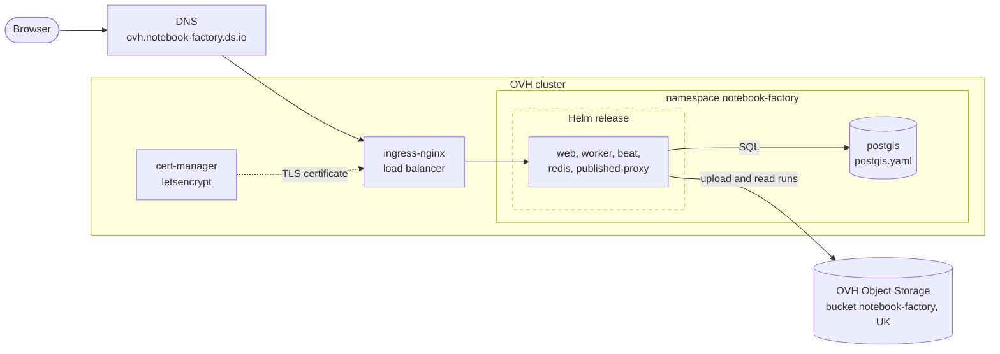

# OVH test deployment

Runs the chart on devseed's OVH Managed Kubernetes cluster at <https://ovh.notebook-factory.ds.io>.
It is for testing only. It adds the pieces that the IFRC deployment gets from Azure instead:

| Here | On IFRC AKS |
|---|---|
| `postgis.yaml`: a PostGIS pod with a 10 GiB volume | Azure Database for PostgreSQL |
| `secrets.sh`: Secrets created by hand | Key Vault, synced by the chart's SecretProviderClass |
| OVH Object Storage, `s3` backend, objects uploaded `public-read` | Azure Blob container with blob-level public access |
| ingress-nginx and a cert-manager `letsencrypt` ClusterIssuer | Traefik and go-deploy's certificates |

Everything inside the dashed box comes from the chart; see [`helm/README.md`](../../helm/README.md).



## Setup

1. Create the bucket `notebook-factory` in the UK region and an S3 user with access to it. Leave
   listing private: the app uploads every object with a `public-read` ACL.
2. Point `ovh.notebook-factory.ds.io` at the ingress-nginx load balancer.
3. Create the namespace and Secrets. Re-running keeps the generated Postgres password and `SECRET_KEY`.

   ```sh
   S3_ACCESS_KEY=… S3_SECRET_KEY=… deploy/ovh/secrets.sh
   ```

4. Start PostGIS and install the chart:

   ```sh
   kubectl -n notebook-factory apply -f deploy/ovh/postgis.yaml
   helm upgrade --install notebook-factory ./helm -n notebook-factory -f deploy/ovh/values.yaml
   ```

   Add `--set image.tag=<tag>` to run an image other than the chart's `appVersion`.

5. Load demo data and create an admin user:

   ```sh
   kubectl -n notebook-factory exec deploy/notebook-factory-web -- python manage.py seed_demo --countries NPL
   kubectl -n notebook-factory exec -it deploy/notebook-factory-web -- python manage.py createsuperuser
   ```

## OVH specifics

- The proxy upstream must be the virtual-host URL (`https://<bucket>.s3.<region>.io.cloud.ovh.net`).
  OVH rejects anonymous path-style GETs.
- Cinder volumes have `lost+found` at their root, so `postgis.yaml` sets `PGDATA` to a subdirectory.
- Remove everything with `helm uninstall notebook-factory -n notebook-factory` and
  `kubectl delete namespace notebook-factory`. The bucket is not touched.
