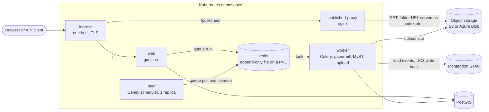

# Helm chart

Deploys the factory to Kubernetes: the web app, a Celery worker, Celery beat, a Redis broker and an
nginx proxy that serves published runs from object storage. PostGIS and the bucket are external.
The target is IFRC GO's AKS cluster through ArgoCD ([go-deploy](https://github.com/IFRCGo/go-deploy));
[`deploy/ovh/`](../deploy/ovh/) is a test deployment on another cluster.



## How a run moves through it

1. The web pod creates the run in PostGIS and queues a Celery task in Redis.
2. A worker takes the task, executes the notebook, builds the MyST site in its `/app/data` emptyDir
   and uploads it to the bucket under `runs/<id>/`.
3. Readers load `https://<host>/published/runs/<id>/`. The proxy fetches `index.html` from the bucket,
   because object storage has no directory index and the MyST page navigates to the folder URL on load.

Beat only schedules: the Montandon poll and the hourly cleanup run on the worker like any other task.

## Resources

| Component | Notes |
|---|---|
| `web` | Runs `migrate`, `collectstatic` and `sync_templates` on start, so keep `web.replicas: 1`. Readiness checks `/healthz`, which queries the database; liveness is a TCP check so a database outage does not restart it. |
| `worker` | Two runs at a time per pod (`CELERY_CONCURRENCY`). Scale with `worker.replicas`. |
| `beat` | Always one replica, `Recreate` strategy, so there are never two schedulers. |
| `redis` | Broker and result backend. The append-only file on a PVC keeps queued runs across restarts. Rollouts stop the old pod first because the volume is ReadWriteOnce. |
| `published-proxy` | GET only. Strips `Cookie` and `Authorization`, gzips text, and redirects a run URL without a trailing slash. Restarts when its rendered config changes. |
| Ingress | `/published/` to the proxy, everything else to `web`. |
| SecretProviderClass | Only when `secretProviderClass.enabled`. Syncs the app Secret from Azure Key Vault through the Secrets Store CSI driver. |

## Values

| Value | Purpose |
|---|---|
| `host` | Public hostname. Sets the ingress host, `ALLOWED_HOSTS`, `CSRF_TRUSTED_ORIGINS`, `PUBLIC_BASE_URL` and `PUBLISHED_PUBLIC_BASE_URL`. |
| `existingSecret` | Secret holding `DATABASE_URL`, `SECRET_KEY`, the storage credentials and optionally `MONTANDON_API_TOKEN`. |
| `env` | Any other setting from `.env.example`, such as `PUBLISHED_STORAGE_BACKEND`, `S3_*` or `AZURE_*`. |
| `publishedProxy.upstream` | Bucket root as an anonymous reader sees it, for example `https://<account>.blob.core.windows.net/<container>`. Objects must be publicly readable. |
| `ingress.className`, `ingress.annotations`, `ingress.tlsSecretName` | Ingress controller and certificate. |
| `secretProviderClass.*` | Key Vault name, tenant, workload identity client ID, and `keys`: the Secret keys to sync. Each is read from the Key Vault secret of the same name with `_` replaced by `-`. |
| `serviceAccount.annotations` | For example `azure.workload.identity/client-id`. |
| `image.tag` | Defaults to the chart's `appVersion`. |

See [`values.yaml`](values.yaml) for resources and the rest.

## Publishing

`.github/workflows/publish.yml` runs on every push to `main`. It pushes the image as
`ghcr.io/developmentseed/notebook-factory:<short sha>` and the chart as version
`<Chart.yaml version>-g<short sha>` to `oci://ghcr.io/developmentseed/charts`, with `appVersion` set to
the same short sha. A chart version therefore pins one image, and an ArgoCD Application upgrades by
changing `targetRevision`.

## Install

```sh
helm upgrade --install notebook-factory oci://ghcr.io/developmentseed/charts/notebook-factory \
  --version <version> -n notebook-factory -f my-values.yaml
kubectl -n notebook-factory exec -it deploy/notebook-factory-web -- python manage.py createsuperuser
```

## Limits

- nginx resolves the bucket hostname once at startup. Add a `resolver` to the proxy config if its addresses change.
- A worker pod that is replaced mid-run gets the default 30 second grace period. Its run is redelivered
  after the broker's visibility timeout.
